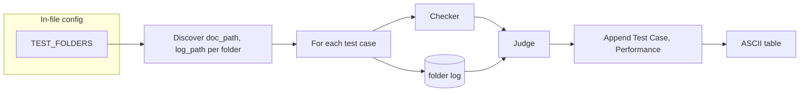

# Inference Performance Table and Batch (In-File Loop)

## 1. Three-category performance label

**Categories:**

- **Match** (highest): Agent caught all problems in the truth set.
- **Partial** (middle): Some overlap between expected and actual.
- **Mismatch** (lowest): Complete mismatch between expected and actual.

**Implementation in [inference_judge.py](rand-personal/inference_validation/inference_judge.py):**

- Add `performance: Literal["match", "partial", "mismatch"]` to `JudgeResult`; update judge prompt so the LLM chooses one.
- Add a small mapping to display strings with emoji, e.g. `match` → `"✅ Match"`, `partial` → `"🟡 Partial"`, `mismatch` → `"❌ Mismatch"`, and a helper `performance_label(result)` for the table.

## 2. ASCII table

- Use **tabulate** with headers `["Test Case", "Performance"]` and rows `(test_case_name, performance_label)`.
- Print after the document loop completes.

## 3. Document loop inside the file; populate from five folders

**Requirement:** The document loop runs **inside** [long_inference_checker.py](rand-personal/inference_validation/long_inference_checker.py). Test cases and truth conditions are **populated from** these folders:

- `complex_argument1`
- `complex_argument2`
- `informal_argument1`
- `informal_argument2`
- `informal_argument3`

**Folder layout (each folder has one log JSON and multiple .md docs):**


| Folder             | Log file                   | Docs (examples)                                     |
| ------------------ | -------------------------- | --------------------------------------------------- |
| complex_argument1  | complex_argument_log.json  | complex_argument1_correct.md, *_minor_wrong.md, ... |
| complex_argument2  | complex_argument2_log.json | complex_argument2_*.md                              |
| informal_argument1 | policy_log.json            | policy_correct.md, policy_*_wrong.md                |
| informal_argument2 | empirical_log.json         | empirical_*.md                                      |
| informal_argument3 | conceptual_log.json        | conceptual_*.md                                     |


**Discovery logic (in-file, no CLI list of paths):**

1. **Base path:** Directory containing the script, e.g. `Path(__file__).resolve().parent` (so `rand-personal/inference_validation`).
2. **Constant:** e.g. `TEST_FOLDERS = ["complex_argument1", "complex_argument2", "informal_argument1", "informal_argument2", "informal_argument3"]`.
3. **For each folder name in TEST_FOLDERS:**
  - `folder_path = base_path / folder_name`
  - **Log:** Find the single JSON log in that folder (e.g. `next(folder_path.glob("*.json"))` or `*_log.json`). Each folder has exactly one `*log*.json`.
  - **Docs:** List all `.md` files in that folder: `folder_path.glob("*.md")`.
  - **Test cases:** For each `.md` file, append `(document_path, log_path)` to a list. Truth for that test case = expected problems from `load_expected_from_log(log_path, doc_basename)`.
4. **Run loop:** For each `(document_path, log_path)`: load doc → run checker → load expected from `log_path` (by doc basename) → run judge → append `(test_case_name, performance_label)` to rows. Test case name can be `f"{folder_name}/{doc_basename}"` (e.g. `complex_argument1/complex_argument1_correct.md`) for uniqueness.
5. **Print:** `tabulate(rows, headers=["Test Case", "Performance"], tablefmt="simple")`.

**Execution:**

- All behavior is driven from the file. No CLI for document paths or batch mode.
- When the script is run, it discovers test cases from the in-file folder list It “run all test folders” (e.g. a flag like `--all` or `--batch`, or no document argument and a default to “run folder suite”). runs the loop and prints the table.
- Optional: suppress per-document verbose output and print only the summary table.

**Edge cases:**

- If a folder has no `.json` or multiple `.json` files: use a clear convention (e.g. `*_log.json` or the filename pattern observed: `complex_argument_log.json`, `complex_argument2_log.json`, `policy_log.json`, `empirical_log.json`, `conceptual_log.json`). Can hardcode log filename per folder or discover via glob `*log*.json` and take the first.
- Missing log entry for a doc: catch `ValueError` from `load_expected_from_log`, record an error row or skip and report at end.

## 4. Data flow (in-file batch)




## 5. File-level checklist


| Area             | File                        | Changes                                                                                                                                                                                                          |
| ---------------- | --------------------------- | ---------------------------------------------------------------------------------------------------------------------------------------------------------------------------------------------------------------- |
| Judge            | `inference_judge.py`        | Add `performance` to `JudgeResult`; update prompt; add `performance_label(result)` with emoji.                                                                                                                   |
| Discovery + loop | `long_inference_checker.py` | Define `TEST_FOLDERS` and base path; function or block that builds `(doc_path, log_path)` from folders (glob .md + .json per folder); when script runs, run loop and print tabulate (no CLI for paths or batch). |


## 6. Example table output (batch)

```
Test Case                            Performance
------------------------------------ --------------
complex_argument1/..._correct.md     ✅ Match
complex_argument1/..._minor_wrong.md 🟡 Partial
...
informal_argument3/conceptual_*_wrong.md ...
```

