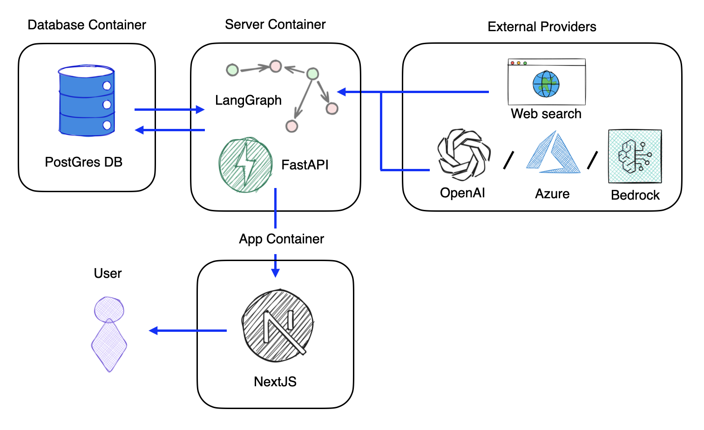

# Draft Detective

[](https://codecov.io/github/agencyenterprise/draft-detective)

AI-powered assistant for academic peer review. Draft Detective runs a suite of targeted checks across language, citations, technical compliance, and substantive content — validating references against claims, flagging unsupported assertions, performing literature reviews, and suggesting relevant citations — helping reviewers and researchers assess rigor more efficiently.

Project funded by RAND: https://rand.org/

## Goals

The main goal of Draft Detective is to assist and streamline the academic peer review process by reducing manual workload and improving the consistency, transparency, and rigor of evaluations.

## Three ways to use Draft Detective

Draft Detective exposes the same review capabilities through three different surfaces. Pick whichever fits your workflow.

### 1. Claude Code and Codex plugin (skills)

Each review is packaged as a self-contained skill under [`skills/`](skills/), distributed as a plugin for [Claude Code](https://docs.claude.com/en/docs/claude-code) and [Codex](https://developers.openai.com/plugins/build/plugins). The skills run the checks **directly inside your assistant session** — no running backend required — guiding the assistant through each review's procedure.

Install the plugin from the marketplace inside Claude Code:

```
/plugin marketplace add agencyenterprise/draft-detective
/plugin install draft-detective@draft-detective
```

The repository also includes a Codex compatibility manifest at [`.codex-plugin/plugin.json`](.codex-plugin/plugin.json), with display metadata, starter prompts, and an explicit path to the shared skills. Both clients use the same skill files:

```text
draft-detective/
├── .agents/
│   └── plugins/
│       └── marketplace.json
├── .claude-plugin/
│   ├── plugin.json
│   └── marketplace.json
├── .codex-plugin/
│   └── plugin.json
└── skills/
    └── <skill-name>/SKILL.md
```

Install in Codex using the catalog at [`.agents/plugins/marketplace.json`](.agents/plugins/marketplace.json):

```bash
codex plugin marketplace add agencyenterprise/draft-detective
codex plugin add draft-detective@draft-detective
```

The Codex catalog points to the repository root (`./`), relative to the marketplace root, so the plugin comes from the same checkout and branch as the catalog. Claude uses its own `.claude-plugin/marketplace.json` catalog. Start a new Codex thread after installation.

If the marketplace was already registered before the Codex catalog was added, refresh it before retrying installation:

```bash
codex plugin marketplace upgrade draft-detective
codex plugin add draft-detective@draft-detective
```

For OpenAI directory submission, package `.codex-plugin/` and the complete `skills/` directory together at the plugin root; follow OpenAI's [skills-only plugin submission guide](https://developers.openai.com/plugins/guides/submit-claude-plugin). Keep the identity, version, and shared metadata in both plugin manifests in sync when releasing.

Then invoke a check in plain language (e.g. _"validate the references in this document with Draft Detective"_), or ask _"what can Draft Detective check?"_ to see the full menu.

Any check that reaches the internet asks for your consent before its first search, because parts of the document travel to a web search provider as queries; the menu marks which ones do. That mirrors the gate the web app and the MCP server enforce.

### 2. MCP server

Connect Draft Detective to Claude, Codex, Opencode, or any MCP-compatible client and run reviews directly from your AI assistant. The backend mounts a [Model Context Protocol](https://modelcontextprotocol.io/) server at `/mcp` with OAuth authentication.

Its tools let an agent list available analyses, create a project, upload documents, run a workflow, and export the results — the same pipeline the web app uses. Register it (pointing at your deployment's URL, e.g. `http://localhost:8000/mcp` in local dev):

```bash
# Claude Code
claude mcp add-json "draft-detective" '{"type":"http","url":"https://<your-deployment>/mcp"}'

# Codex
codex mcp add draft-detective --url https://<your-deployment>/mcp

# Opencode
opencode mcp add   # then follow the interactive prompts (Remote server, paste the URL)
```

The first time you use it, you'll be prompted to authenticate in the browser. The signed-in web app shows the exact command and URL for your deployment on its **MCP Server** page.

### 3. Web app

The full-featured way to use the tool. Upload a draft (`.docx` recommended, PDF also supported — you can upload just a section, such as the references), pick which analyses to run, and review the findings in-browser with the **Document Explorer**. From there you can:

- **Export to Word** as tracked comments.
- **Share a project** with colleagues via a read-only link.
- Fetch or upload the full text of references for the checks that need it (Claim Reference Validation).

Draft Detective also reaches into Microsoft 365 — an experimental **Word add-in** that surfaces the same reviews inside Word, and a **Teams bot** that answers questions about a document in chat. See [`microsoft/README.md`](microsoft/README.md).

To run the web app locally, see [Development](#development). The in-app **About** page documents every analysis type and data-handling detail.

## What it checks

Analyses are grouped by category (shown here in app order). See the in-app **About** page (or [`ABOUT.md`](ABOUT.md)) for evaluation coverage and which checks require web search (`#web_search`) or full-text references (`#full_text_refs`).

**Citation Check**
- **Reference Error Checker** — uses web search to confirm each citation exists online and that its author, title, publisher, and year match public sources, catching typos and hallucinated references.

**Substantive Review**
- **Claim Reference Validation** — checks every citation against its referenced source (via RAG) and flags claims that are unsupported, only partially supported, or unverifiable.
- **Internal Inference Validation** — flags logical fallacies, unsupported conclusions, and arguments where the evidence doesn't back the claim.
- **Methodological Alignment** — characterizes standard methods in the field via web search, then compares your methodology and highlights gaps and risks.
- **Reproducibility Check** — extracts the main results and classifies each by how reproducibly it could be recreated from the document alone.
- **Reviewer 2** — a simulated senior-reviewer peer review: strengths, weaknesses, next steps, and a devil's-advocate rebuttal.
- **Recommendation Check** — flags recommendations whose backing in the document's own findings is weak, indirect, missing, or contradictory.

**Editorial & Style Review**
- **Abbreviation Scan** — verifies each abbreviation is defined at first use and listed in an Abbreviations section.
- **About This** — checks the preface meets publication requirements (context, objectives, audience, funding, author bios).
- **Document Contents** — checks that required sections are present (About This, Acknowledgements, Methods, Results, Conclusion, References, Appendix).
- **Figures & Tables Check** — verifies every figure and table is titled, consistently numbered, cited in the body, and that all body-text references resolve.

**Language**
- **Advocacy & Tone** — flags trigger words, advocacy language, and subjective tone that departs from a neutral, objective voice.
- **Active Voice & Clear Actors** (experimental) — flags passive-voice sentences and sentences whose inanimate subject hides who is responsible, with an active rewrite proposed for each.

Some analyses are experimental and hidden by default in the web app (enable "Experimental Features" in your profile menu).

## Architecture

Python backend (FastAPI + LangGraph agent workflows) with a Next.js frontend. Documents are ingested through a processing pipeline; each analysis is a LangGraph workflow that emits findings back into the document.



## Development

For detailed setup instructions (backend, frontend, Docker, migrations, environment variables), see [DEVELOPMENT.md](DEVELOPMENT.md).

To add a new check, see [docs/skill-workflows.md](docs/skill-workflows.md): a single-pass check is one `SKILL.md` with a `draft_detective` block in its frontmatter, and the guide covers writing the rules, evals, and managing the workflow afterwards.

```bash
# Backend (always use uv)
uv run dev.py                 # Start the full dev environment (API on :8000)

# Frontend (always use pnpm)
cd frontend && pnpm install
cd frontend && pnpm dev       # App on :3000
```

## Deployment

- **Railway**: See [docs/railway-deployment.md](docs/railway-deployment.md) for production deployment on Railway.
- **Kubernetes**: See [k8s/README.md](k8s/README.md) for Kubernetes/OpenShift deployment.

## Testing

Tests are organized by type:

- **`tests/unit/`** — Fast, isolated unit tests
- **`tests/integration/`** — Multi-component integration tests
- **`evals_inspectai/`** — LLM-based evaluations using Inspect AI

```bash
# Run standard tests (default)
uv run pytest

# Run evaluations (see evals_inspectai/ for available eval suites)
uv run inspect eval evals_inspectai/e2e/reference_validation_v2/reference_validation_v2_e2e.py
```

## License

See [LICENSE](LICENSE) file
