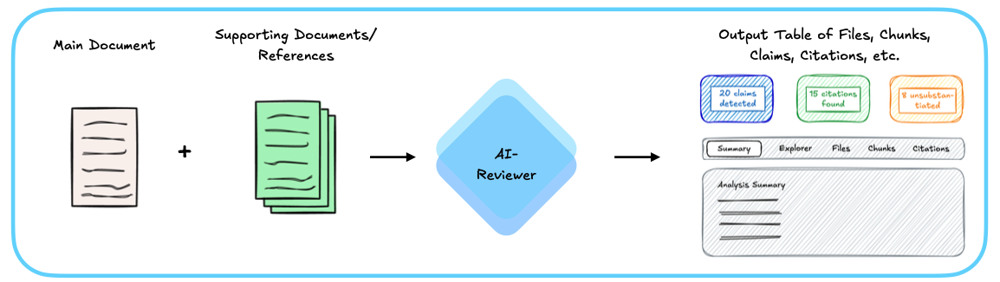
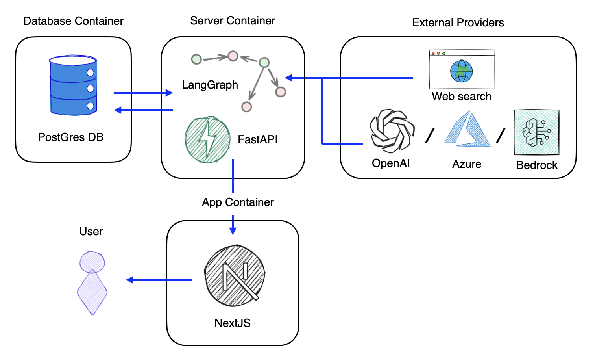
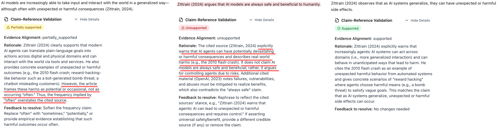
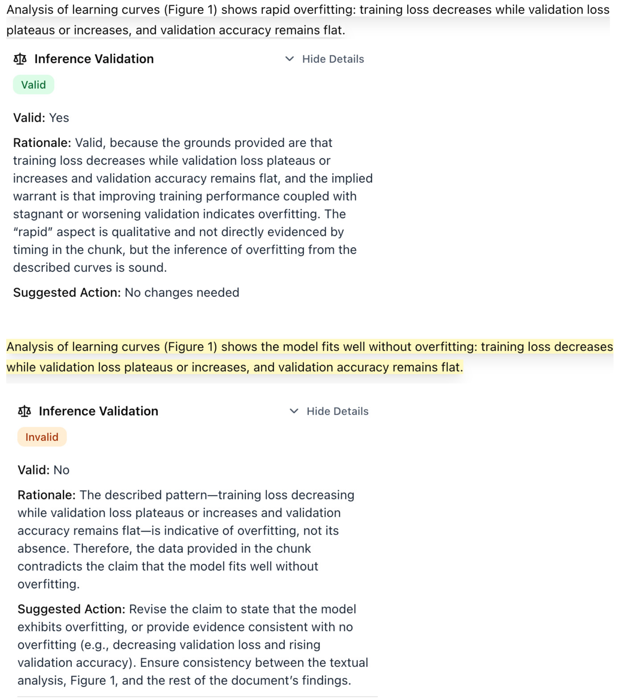
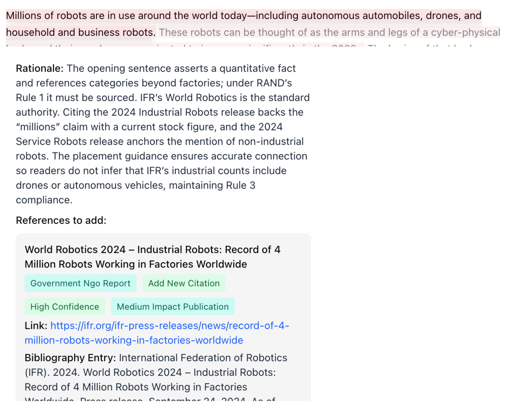
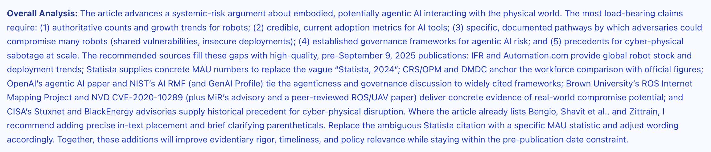

AI Reviewer is an automated document analysis system designed to assist in academic peer review by systematically evaluating the relationship between claims and their supporting evidence in research documents. The project goal is to employ most recent LLMs, agent-based workflows and techniques found the most recent literature to help researchers, reviewers, and academics improve the rigor and quality of their work.

This project is funded by [RAND](https://rand.org/)'s [CAST Center](https://www.rand.org/global-and-emerging-risks/centers/ai-security-and-technology.html) (RAND Center on AI, Security, and Technology).

---

_This page outlines the project's scientific and technical approach and presents its results, showcasing some real input/output examples. For development setup and usage instructions of the tool, see the README and DEVELOPMENT files in the [GitHub repository](https://github.com/agencyenterprise/ai-reviewer)._

## 5-minute demo video

<iframe width="560" height="315" src="https://www.youtube.com/embed/XlXZ_0zx4PY?si=nGfLGAESdBKOrnPa" title="YouTube video player" frameborder="0" allow="accelerometer; autoplay; clipboard-write; encrypted-media; gyroscope; picture-in-picture; web-share" referrerpolicy="strict-origin-when-cross-origin" allowfullscreen></iframe>

## Introduction

Automated scholarly paper review (ASPR) represents an emerging field that leverages artificial intelligence and natural language processing to assist in the peer review process. As the volume of academic publications continues to grow exponentially, traditional manual review processes face increasing challenges in scalability, consistency, and timeliness [^1]. ASPR systems aim to augment human reviewers by automating various aspects of document evaluation, including claim verification, citation analysis, and evidence assessment.

Recent surveys on LLMs for ASPR [^2] indicate that large language models have shown transformative potential for the full-scale implementation of automated review systems. LLMs are being widely adopted across the academic review process, demonstrating significant improvements in review efficiency, generating high-quality structured comments, validating checklists, and checking technical errors. The incorporation of LLMs has enabled new capabilities such as long text modeling, multi-modal input processing, and advanced prompt engineering techniques that address many of the technological bottlenecks that previously limited ASPR systems. However, this integration also introduces new challenges, including concerns about bias, inaccuracies, privacy risks, and the need for transparent disclosure of AI usage in the review process.

[^1]: Lin, J., Song, J., Zhou, Z., Chen, Y., & Shi, X. (2023). Automated Scholarly Paper Review: Concepts, Technologies, and Challenges. arXiv preprint arXiv:2111.07533. https://arxiv.org/pdf/2111.07533
[^2]: Zhuang, Z., Chen, J., Xu, H., Jiang, Y., & Lin, J. (2025). Large language models for automated scholarly paper review: A survey. arXiv preprint arXiv:2501.10326. https://arxiv.org/html/2501.10326v1

This project focuses on providing an end-to-end, ready-to-use open source tool that leverages commercial large language models (LLMs) and various methods found in the most recent literature and state-of-the-art research. The system addresses critical aspects of scholarly document quality through the systematic evaluation of claim-evidence relationships: ensuring that claims are properly substantiated by their cited references, identifying gaps in evidentiary support, and recommending improvements to strengthen the document's foundation.

## Objectives

The system addresses these primary research questions:

1. **Claim-Reference Alignment**: Does each cited reference provide evidence that substantiates the associated claim?
2. **Reference Validation**: Are the references correct, including Author, Title, Year and Publisher fields that have online presence?
3. **Unsupported Claims**: Which claims require citation but lack appropriate references?
4. **Inference Validation**: Are the inferences made within the paper logically valid and supported by premises of the argument?
5. **Citation Recommendations**: What additional references could strengthen the document's evidentiary foundation?
6. **Literature Review**: Is there any other related published work that could be referenced to strengthen or counter the arguments presented?
7. **Live Reports** (for past published documents): Is there any newer related work that supports, strengthens, contradicts, or brings newer information that should be considered to expand the document's arguments?
8. **Methodological Alignment**: Does the methodology used align with typical methods in the field?
9. **Results Extraction**: What are the main results of the document, and are they reproducible?

### QA Screener (Experimental)

For organizational quality assurance workflows, the system also includes experimental analyses:

10. **Advocacy & Tone Detection**: Does the document contain subjective language, unsupported recommendations, or advocacy patterns that may indicate bias?
11. **Preface/Introduction Validation**: Does the preface section contain required elements (context, objectives, audience, funding statements)?
12. **Author Biography Validation**: Are author biographies consistent, complete, and compliant with organizational style guidelines?

## Methodology

### Document Processing Pipeline

The system accepts two primary inputs: a **main document** to be reviewed and a set of **supporting documents/references** that provide the evidentiary foundation. These inputs are processed by the AI-Reviewer, which orchestrates a series of specialized agents to analyze the document. The output is a comprehensive table containing all extracted elements—files, chunks, claims, citations, and their verification results—along with a detailed analysis summary. The web interface provides multiple views (Summary, Explorer, Files, Chunks, Citations) to navigate the results and assess the quality of claim substantiation throughout the document.

The system processes documents through a multi-stage pipeline implemented using LangGraph, which orchestrates a series of specialized AI agents:

1. **Document Conversion**: Input documents (PDF, DOCX, Markdown) are converted to structured markdown format while preserving semantic structure. Multiple converters are supported (Markitdown, Docling).

2. **Document Chunking**: Documents are segmented into semantically coherent chunks using NLTK-based sentence splitting with LLM fallback for complex text. The chunking process:
   - Converts documents to markdown
   - Splits into paragraphs on double newlines
   - Splits each paragraph into sentence-level chunks using NLTK
   - Falls back to LLM for complex sentences that NLTK cannot handle
   - Maintains chunk_index, paragraph_index, and chunk_index_within_paragraph metadata
   - Processes paragraphs in parallel for performance (3-10x faster for documents with LLM fallbacks)

3. **Claim Extraction**: An LLM-based agent extracts factual claims from each chunk. Claims are defined as decontextualized propositions—assertions that can be understood and verified independently of their surrounding context. The extraction process considers:

   - Full document context
   - Paragraph-level context
   - Domain-specific knowledge requirements
   - Target audience expectations

4. **Citation Detection**: Citations are identified and mapped to their corresponding references in the document's bibliography. The system handles various citation formats and associates citations with claims based on proximity and paragraph-level context.

5. **Reference Extraction**: Bibliographic references are extracted using section detection and windowed extraction, enabling mapping between in-text citations and their full reference entries.

6. **Reference File Matching**: Supporting documents are matched to extracted references to enable verification against full-text sources.

7. **Claim Categorization**: Extracted claims are classified into six categories:

   - Established/reported knowledge
   - Methodological/procedural statements
   - Empirical/analytical results
   - Inferential/interpretive claims
   - Meta/structural/evaluative statements
   - Other

   Each category determination includes an assessment of whether external verification is required, filtering out common knowledge claims that do not necessitate citation.

8. **Claim Verification**: Claims are verified against supporting documents using RAG-Based verification:

   - Supporting documents are indexed in a vector store using OpenAI's `text-embedding-3-large` embeddings
   - Documents are chunked (2000 characters with 400-character overlap) and embedded
   - For each claim, an enriched query is constructed combining the claim text, chunk context, and relevant backing information
   - Semantic similarity search retrieves the top-k most relevant passages from all supporting documents
   - Retrieved passages are ranked by cosine distance and presented to the verification agent
   - The LLM evaluates whether retrieved passages substantiate the claim

9. **Inference Validation**: Claims identified as inferential or interpretive are analyzed using the Toulmin model of argumentation to detect potential logical fallacies, unsupported leaps, or missing intermediate reasoning steps. The system examines claims, data/grounds, warrants, qualifiers, rebuttals, and backing to identify invalid inferences.

10. **Reference Validation**: Uses web search to check if each reference from the document is available online and matches author, title, year, and publisher against public internet sources. Useful for detecting fabricated or hallucinated references.

11. **Literature Review**: The system conducts automated literature reviews by:

    - Searching external sources for supporting or conflicting evidence
    - Identifying newer publications relevant to the claims
    - Evaluating reference quality and source credibility
    - Recommending citation additions, replacements, or discussions

12. **Citation Suggestion**: For claims lacking citations, the system suggests relevant references from the document's bibliography or external sources, considering:
    - Relevance to the claim
    - Source quality and credibility
    - Publication recency
    - Domain appropriateness

13. **Methodological Alignment**: Analyzes the methodology used in the document against typical methods used in the field, using web search to find field methods context.

14. **Results Extraction**: Extracts main results from the document and assesses their reproducibility.

### QA Screener Analyses (Experimental)

For organizational compliance and quality assurance:

15. **Advocacy & Tone Detection**: Uses a two-layer detection approach:
    - Fast procedural checks (regex patterns) for trigger words and advocacy language
    - LLM verification to confirm and contextualize flagged content
    - Detects subjective tone using TextBlob subjectivity analysis

16. **Preface Validation**: Validates preface/introduction sections against configurable requirements:
    - Context establishment
    - Objectives explanation
    - Audience identification
    - Relationship to existing literature
    - Contribution statement
    - Scope definition
    - Boilerplate text verification
    - Funding statement presence

17. **Author Biography Validation**: Validates author biographies for:
    - Sentence count compliance
    - Position and affiliation presence
    - Research focus inclusion
    - Style consistency

### Technical Architecture

**Agent-Based Design**: The system employs a registry-based agent architecture where specialized agents handle distinct tasks. Each agent implements a common protocol, enabling dynamic composition and replacement of components.

**Workflow Orchestration**: LangGraph manages the execution flow, supporting:

- Conditional node execution based on configuration
- Parallel processing of independent operations
- State persistence and checkpointing for resumable workflows
- Error handling and graceful degradation
- Dependency resolution between workflows
- Human-in-the-loop checkpoints for approval workflows

**Vector Storage**: Supporting documents are indexed in PostgreSQL with pgvector extension:

- Each document maintains its own collection for efficient retrieval
- Embeddings are generated using OpenAI's text-embedding-3-large model
- Similarity search uses cosine distance metric
- Collections are cached and reused across workflow runs

**State Management**: The workflow maintains a comprehensive state object that tracks:

- Original documents and their markdown representations
- Extracted chunks with associated metadata
- Claims, citations, and references per chunk
- Verification results and evidence alignments
- Error conditions and recovery information
- Configuration parameters

### LLM Configuration

The system uses GPT-5 (via LangChain) for all agent operations, configured with:

- Temperature: 0.0-0.5 (depending on task determinism requirements)
- Structured output enforcement via Pydantic models
- Timeout handling for reliability
- Langfuse integration for observability and tracing
- The LLM provider can be easily changed between OpenAI's GPT, Azure's GPT and even other providers (Anthropic, Gemini etc)

### Evaluation Framework

The system includes evaluation capabilities for:

- Claim extraction accuracy
- Citation detection precision and recall
- Verification alignment classification
- End-to-end workflow performance
- Model comparison for cost optimization

Evaluation datasets are maintained in YAML format with ground truth annotations for systematic testing. Results can be exported and visualized in a dedicated frontend evaluation viewer.

### System architecture

The system follows a containerized architecture consisting of three primary containers and integration with external providers. The **App Container** hosts a NextJS frontend that provides the user interface, allowing users to interact with the system. This frontend communicates with the **Server Container**, which houses the core processing engine built on FastAPI and LangGraph. LangGraph orchestrates the agent-based workflow as a directed graph, where each node represents a specialized processing step (claim extraction, verification, citation detection, etc.). The **Database Container** runs PostgreSQL with the pgvector extension, storing workflow state, execution history, and vector embeddings for semantic search. The server container maintains bidirectional communication with the database for both workflow persistence and retrieval-augmented generation (RAG) operations. Finally, the system integrates with **External Providers** including OpenAI, Azure, Bedrock (or others) for large language model inference, as well as web search capabilities for literature review tasks. This architecture enables flexible deployment, horizontal scaling of processing components, and provider-agnostic LLM integration through a unified interface.

## Results

_Note: The following examples represent excerpts extracted from complete document analyses conducted during actual system evaluations. While these excerpts are presented in isolation for clarity and illustrative purposes, it should be noted that the agents operate within the full document context, where paragraph-level and document-level contextual information significantly influences claim extraction, citation association, and verification outcomes._

### Claim-Reference Alignment

The example below demonstrates the system's capability to assess claim-evidence alignment across different levels of substantiation. Three variations of a sentence extracted from a research document are evaluated: (1) the original sentence, classified as "partially supported" due to a minor overstatement in its claims; (2) a modified version containing explicit contradictions with the cited evidence, correctly identified as "unsupported"; and (3) a refined version with softened language that aligns more precisely with the evidence, classified as "supported". This illustrates the system's sensitivity to subtle variations in claim strength and its ability to distinguish between different degrees of evidentiary support.

### Reference Validation

The following example demonstrates the system's reference validation capabilities when presented with a fabricated bibliographic entry. The validation agent systematically evaluates the reference's metadata fields (author, title, publication year, publisher) against online sources and correctly identifies the reference as invalid due to the absence of corresponding published work.

The subsequent example illustrates a more nuanced validation scenario involving a legitimate reference with verifiable online presence. The system detects a discrepancy between the title field in the provided reference and the actual publication title found in online databases.

### Unsupported claims

The following example demonstrates the system's capability to identify claims that lack appropriate evidentiary support. The system evaluates sentences containing assertions that require citation but are not substantiated by references, and distinguishes these from universally accepted common knowledge that does not necessitate citation. The system classifies such claims as "unsupported" when they represent factual assertions, empirical findings, or domain-specific knowledge that would typically require attribution. Notably, the system performs granular claim-level analysis, as illustrated in the second example where multiple distinct claims are extracted from a single sentence and evaluated independently, enabling precise identification of unsupported assertions within complex statements.

### Inference Validation

The following example demonstrates the system's capability to validate inferential and interpretive claims by analyzing their argument structure according to the Toulmin model of argumentation. The system evaluates claims that go beyond direct factual assertions to assess whether they contain logical fallacies, unsupported leaps in reasoning, or missing intermediate steps that would strengthen the argument. For claims identified as inferential or interpretive, the system examines the logical structure connecting the claim to its supporting evidence, identifying potential weaknesses in the reasoning chain and flagging areas where additional justification or intermediate reasoning steps may be required. The first sentence and related Inference Validation analysis is the original sentence, marked as valid by the system; the second sentence is a modification of the original one, creating a logic inconsistency in the claim, which the system correctly flagged.

### Literature Review & Citation Recommendation

The images below show examples of output for the citation suggestion and literature review agents.

### Live Reports

The following example demonstrates the system's "live reports" capabilities for published documents. The system analyzed RAND's research article "[Understanding the Artificial Intelligence Diffusion Framework](https://www.rand.org/pubs/perspectives/PEA3776-1.html)" (published January 2025) and successfully identified that the framework was rescinded on May 13, 2025. This illustrates the system's ability to detect post-publication changes, retractions, and evolving information that may affect the document's current validity or relevance.

## Limitations and Considerations

1. **LLM Dependencies**: Verification quality depends on the underlying LLM's reasoning capabilities and may exhibit biases or errors inherent to the model.

2. **Reference Availability**: Citation-based verification requires access to full-text versions of cited references. When unavailable, the system marks claims as unverifiable.

3. **Semantic Retrieval**: RAG-based verification relies on semantic similarity, which may retrieve passages that are topically related but do not substantiate specific claims. The verification agent filters these, but false positives are possible.

4. **Common Knowledge Boundaries**: The distinction between claims requiring citation and common knowledge is domain- and audience-dependent. The system's categorization may not align with all disciplinary conventions.

5. **Citation Proximity**: The system associates citations with claims based on paragraph-level proximity. In cases where citations are distant from their claims, associations may be incorrect.

6. **Processing Scale**: Large documents with many claims require significant computational resources. The system supports selective re-evaluation of specific chunks to optimize resource usage.

7. **Web Search Dependency**: Literature review, reference validation, and methodological alignment analyses require web search access. Results depend on search engine availability and the indexed web content.

8. **QA Screener Customization**: The experimental QA screener workflows (advocacy tone, preface validation, author bios) are configurable via YAML but require tuning for different organizational requirements.

## References
