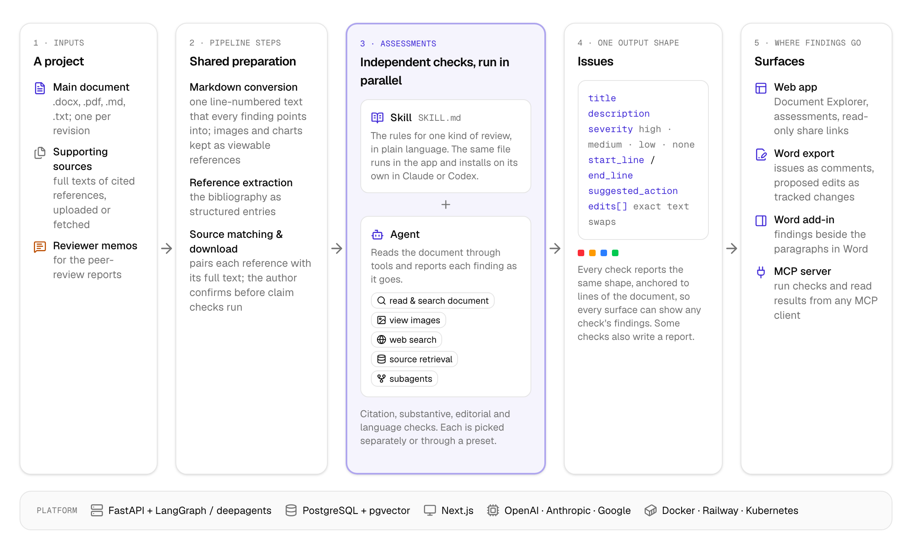
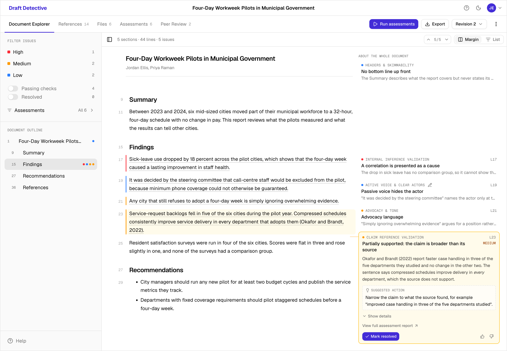
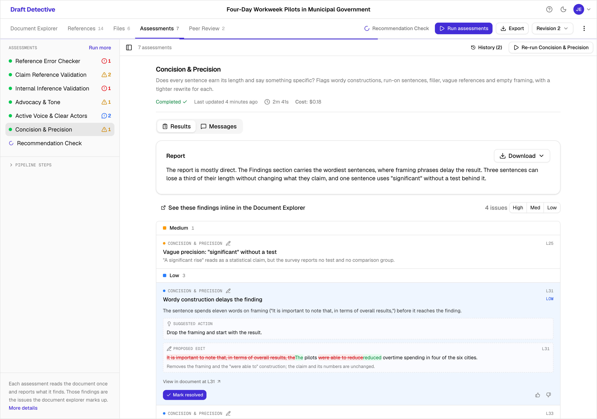
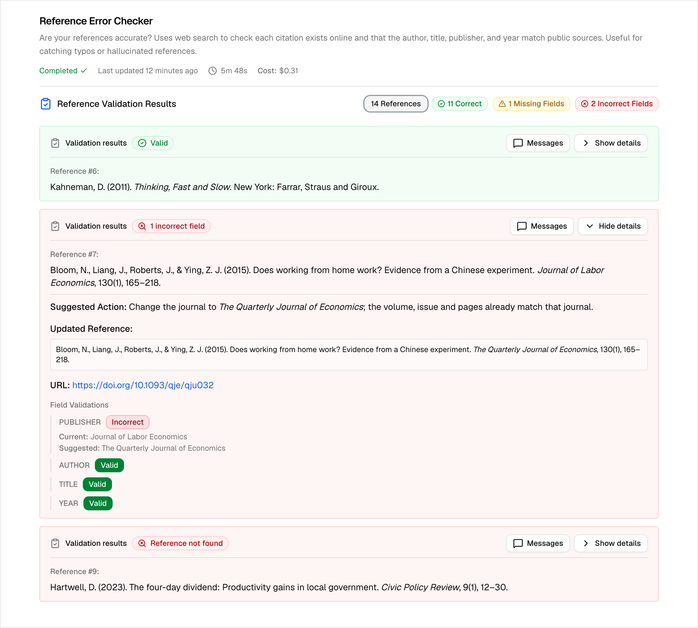
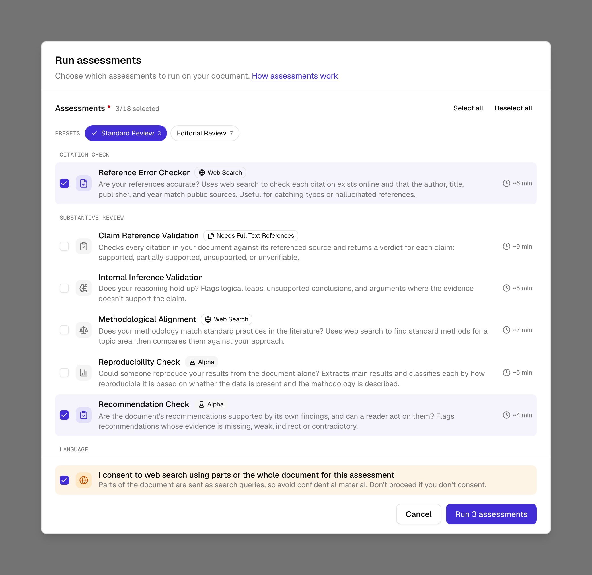

Draft Detective is an open-source assistant for reviewing research documents before they are published. It runs a set of independent checks over a draft (citations, reasoning, methods, editorial requirements and language) and reports what it finds as issues pinned to the lines of the text they concern. The author reads each issue, decides what to change, and marks it resolved.

This project is funded by [RAND](https://rand.org/)'s [CAST Center](https://www.rand.org/global-and-emerging-risks/centers/ai-security-and-technology.html) (RAND Center on AI, Security, and Technology).

---

_This page covers the project's approach and design. For setup and usage, see the [README](https://github.com/agencyenterprise/draft-detective#readme) and [DEVELOPMENT](https://github.com/agencyenterprise/draft-detective/blob/main/DEVELOPMENT.md) files in the [GitHub repository](https://github.com/agencyenterprise/draft-detective)._

## Background

Automated scholarly paper review is a growing research area that applies language technology to parts of peer review: checking claims against evidence, analysing citations, and assessing structure and clarity [^1]. Recent surveys find that large language models make much of this practical, from generating structured comments to verifying checklists and catching technical errors, while raising concerns about bias, inaccuracy, privacy and disclosure [^2].

Draft Detective turns that research into a tool an author or reviewer can use on a real draft. It does not score a paper or recommend acceptance. It points at specific passages, says what is wrong with each and why, and leaves the judgement to a person.

[^1]: Lin, J., Song, J., Zhou, Z., Chen, Y., & Shi, X. (2023). Automated Scholarly Paper Review: Concepts, Technologies, and Challenges. arXiv preprint arXiv:2111.07533. https://arxiv.org/pdf/2111.07533
[^2]: Zhuang, Z., Chen, J., Xu, H., Jiang, Y., & Lin, J. (2025). Large language models for automated scholarly paper review: A survey. arXiv preprint arXiv:2501.10326. https://arxiv.org/html/2501.10326v1

## What it checks

Each check, called an **assessment**, answers one narrow question about the document. They fall into four groups:

| Group | The kind of question it asks | Examples |
|---|---|---|
| Citation check | Are the references real and correctly cited? | Reference Error Checker |
| Substantive review | Do the claims, reasoning, methods and recommendations hold up? | Claim Reference Validation, Internal Inference Validation, Methodological Alignment, Recommendation Check |
| Editorial and style review | Does the document meet structural and house-style requirements? | Figures & Tables Check, Abbreviation Scan, Headers & Skimmability |
| Language | Is the prose neutral, direct and consistent? | Advocacy & Tone, Active Voice & Clear Actors, Concision & Precision |

Beyond these, a peer-review workspace helps authors respond to reviewers: it turns reviewer memos into a revision plan, drafts a response memo per reviewer, and reports which points a revised draft addresses. A simulated reviewer (Reviewer 2) writes a whole-document critique with a devil's-advocate rebuttal.

The set of assessments grows regularly, so this page does not list them all. The current list, with what each one measures, is in the app's **Run assessments** dialog, in the [`skills/`](https://github.com/agencyenterprise/draft-detective/tree/main/skills) folder, and in the [eval scores report](./eval-scores.md).

## Design principles

**One check, one question.** An assessment reads the document for a single kind of problem and nothing else. Narrow checks are easier to write, test and trust than one prompt that reviews everything, and a user can run only the ones that matter for a given draft. Presets such as _Standard Review_ and _Editorial Review_ select a useful group in one click.

**The rules are written as skills.** The instructions for an assessment live in a plain-language `SKILL.md` file: what to look for, how to judge it, how severe each kind of problem is, and what a good fix looks like. The app's agents load these files at run time, and the same files install on their own as a plugin for Claude Code or Codex, so a check behaves the same inside the app and in a chat assistant. A new single-pass check needs no Python code: a `SKILL.md` with a short block of frontmatter registers it, and regenerating the frontend's API types makes it available in the app (see [adding a check](./skill-workflows.md)).

**Every finding is an issue in the text.** However different the checks are, they all report in one shape:

```json
{
  "title": "Partially supported: the claim is broader than its source",
  "description": "Okafor and Brandt (2022) report faster case handling in three of the five departments they studied. The sentence says compressed schedules improve delivery in every department.",
  "severity": "medium",
  "start_line": 23,
  "end_line": 23,
  "suggested_action": "Narrow the claim to what the source found.",
  "edits": []
}
```

Severity is `high`, `medium`, `low`, or `none` for a check that passed and is worth confirming. The line numbers point into a normalised copy of the document that every check shares, which is what lets the web app, the Word export and the MCP server show any check's findings without knowing anything about the check that produced them.

**Critique, don't write.** A check may propose an exact text replacement (an `edit`) only when the finding fully determines the fix, as with a passive sentence or a mislabelled figure. It never invents a citation, a number or a paragraph. When the right fix needs the author's knowledge, the issue says what is needed and stops there.

**Evidence before verdicts.** Claims are checked against the full text of the sources they cite, not against the model's memory, and the author confirms which file belongs to which reference before those checks run. References are checked against what can be found on the web. Any check that searches the web asks for consent first, because parts of the document are sent as search queries.

**Measured end to end.** Most assessments have an evaluation suite that runs it through the real API on labelled documents (see [Evaluation](#evaluation)).

## How it works

[](./images/architecture.png)

1. **A project** holds the draft under review, the full texts of its references, and any reviewer memos. Uploading a revised draft starts a new revision. The web app offers to re-run the earlier assessments on it, and does so by default; the peer-review reports are left for the author to start.
2. **Pipeline steps** prepare what every assessment needs. The draft is converted to line-numbered Markdown (images and charts are kept so that checks able to read images can inspect them), its bibliography is extracted, and each reference is matched to an uploaded source file or fetched from the web.
3. **Assessments** run in parallel, each one independent of the others. Most are a skill plus an agent built on [LangGraph](https://www.langchain.com/langgraph) and [deepagents](https://github.com/langchain-ai/deepagents). The agent reads the document through tools (read and search the document, view an image, search the web, retrieve passages from a cited source, hand work to a subagent) and reports each finding through a reporting tool that validates it on the spot. Some agents split the work: Internal Inference Validation runs three independent detection passes, then has a separate adjudicator judge every candidate before anything is reported. A few checks that need per-item structure, such as the Reference Error Checker, are hand-built LangGraph graphs instead.
4. **Issues** are stored per revision. Some assessments also write a report, such as a methodology comparison or a peer review.
5. **Surfaces** present the same issues in different places: the web app, a Word export where issues become comments and proposed edits become tracked changes, a Word add-in, and an [MCP](https://modelcontextprotocol.io/) server that lets Claude, Codex or any other MCP client create projects, run assessments and read the results.

## What it looks like

_The screens below are synthetic examples: the document, its authors and its findings are invented to show the interface. They are rendered from HTML mockups of the app in [`docs/mockups/`](https://github.com/agencyenterprise/draft-detective/tree/main/docs/mockups)._

### Findings in the document

The Document Explorer shows the draft with a line gutter. A coloured rule marks every paragraph with an issue, and the issues sit in the margin beside the text they concern. Here Claim Reference Validation has found that a sentence claims more than its cited source supports, while other checks have flagged a correlation presented as a cause, a passive sentence, and advocacy language.

[](./images/document-explorer.png)

### Proposed edits

When a fix is purely mechanical, the issue carries a proposed edit shown as a word-level diff. Proposed edits can be exported to Word as tracked changes, which the author accepts or rejects there.

[](./images/assessments.png)

### Reference checks

The Reference Error Checker searches for each reference and compares its author, title, publisher, year and identifier with what it finds. Here it confirms one reference, catches a real paper cited under the wrong journal, and fails to find a reference that does not exist.

[](./images/reference-validation.png)

### Choosing assessments

Users choose which assessments to run, individually or through a preset. Each one is labelled if it searches the web, needs the full text of references, or proposes edits, and web-searching checks need explicit consent before they run.

[](./images/run-assessments.png)

## Evaluation

Most assessments have an end-to-end evaluation suite under `evals_inspectai/e2e/`, built on [Inspect AI](https://inspect.aisi.org.uk/). Every sample triggers the real workflow through the API, so a run exercises the same pipeline a user would. Each suite pairs a labelled dataset with two kinds of scorer:

- **Deterministic** scorers compare the structured output with expected values wherever there is a checkable answer: issue counts, verdicts, flagged line ranges, proposed edits.
- **Model-graded** scorers use an LLM judge for output that cannot be matched literally, such as a written report.

Current scores for every suite are in the [eval scores report](./eval-scores.md). The raw Inspect logs, with every sample, transcript and score, can be browsed in the [hosted log viewer](https://agencyenterprise.github.io/draft-detective/evals-viewer/).

## Technology

- **Backend:** Python, FastAPI, LangGraph and deepagents, with LangChain model integrations. Assessments run as background tasks, and their state is saved in PostgreSQL.
- **Models:** provider-agnostic. Every agent currently runs OpenAI's `gpt-5.6-terra`, and Anthropic and Google models are supported through the same interface. Web search uses each provider's built-in search tool. Embeddings for source retrieval use `text-embedding-3-large`, stored in PostgreSQL with pgvector.
- **Documents:** Word, PDF, Markdown and text files, converted with MarkItDown, pypdfium2 and LibreOffice. Word export adds comments and tracked changes to the document.
- **Frontend:** Next.js and React with shadcn/ui.
- **Operations:** Google and Microsoft sign-in, optional Langfuse tracing, and deployment with Docker on Railway or Kubernetes (see [Railway deployment](./railway-deployment.md)).

## Limitations

1. **Model judgement.** Every finding comes from a language model and can be wrong, or can miss a problem. Issues are suggestions for an author to weigh, not verdicts.
2. **Source availability.** Claim checks need the full text of the cited sources. Where a source cannot be found or uploaded, the claims that cite it are marked unverifiable.
3. **Retrieval.** Claim checks retrieve passages from a source by meaning, and a passage on the right topic may still not support the specific claim. The agent reads the retrieved text to judge it, but false positives are possible.
4. **The live web.** Reference, methodology and literature checks depend on what a web search returns on the day, so results can vary between runs.
5. **House style.** The editorial and language checks encode a particular publisher's style rules. Other organisations may need to adjust the skills to match their own requirements.
6. **Scale.** Long documents take longer and cost more, especially with many references. Each assessment reports its running time and cost.

## References
